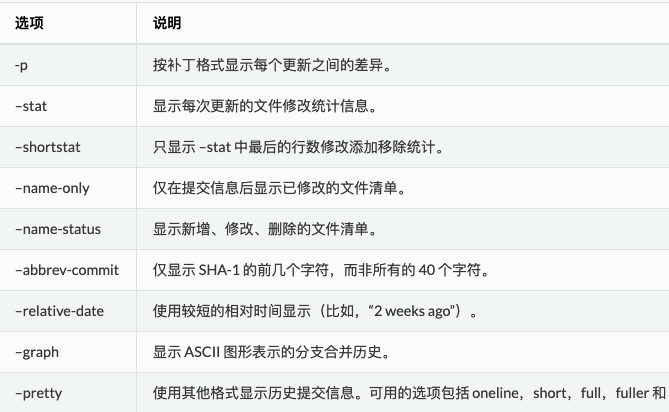
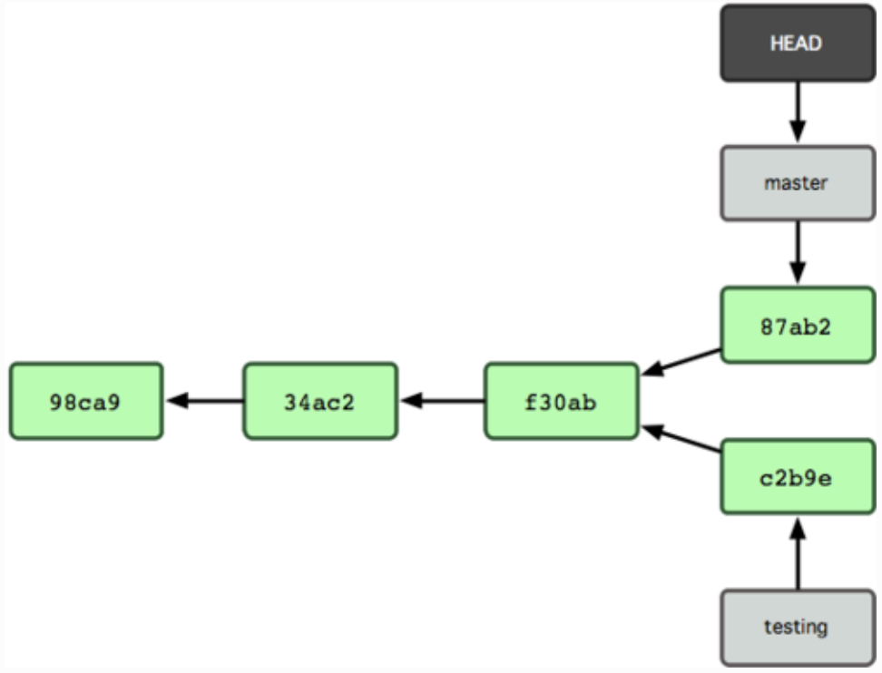

### git

#### git配置

- 配置文件
> `/etc/gitconfig`：所有用户共用，`git config --system`修改的就是这个文件  
> `~/.gitconfig`：当前用户所属，`git config --global`修改的就是这个文件  
> `.git/.gitconfig`：当前项目中的配置文件，`git config`修改的就是这个文件  
> 优先级： `.git/.gitconfig` > `~/.gitconfig` > `/etc/gitconfig`

- 配置用户信息
```
git config --global user.name "username"
git config --global user.email "email-name@email.com"
```

- 查看已有配置信息
> `git config --list`

- 查看帮助信息
> `git help <verb>` or `git <verb> --help` or `man git-<verb>`

#### git基础

- 初始化新仓库
> 在项目目录中执行`git init`

- 从现有仓库中克隆（实际上是克隆.git目录）
> `git clone <URL>`

- 检查当前文件状态
> `git status`

- 忽略某些文件
> 在`.gitignore`中添加文件路径（可以是glob模式，即shell简化了的正则表达式）

- 查看差异
> `git diff`: 比较工作目录中当前文件和暂存区域快照之间的差异。  
> `git diff --cached` or `--staged`: 比较已暂存文件和上次提交的快照之间的差异。

- 提交更新
> `git commit -m "**"`  
> git commit -a -m "**"`: 可以直接将修改文件提交。

- 删除文件
> `rm`: 仅删除工作目录中的文件，但不删除文件的跟踪状态(即暂存区的记录)。   
> `git rm`: 删除文件的跟踪状态，并同时删除工作目录中的文件。 
> `git rm --cached **`: 删除文件的跟踪状态，但不删除工作目录中的文件。  

- 查看提交历史
> `git log`  
> `git log -p n`: 查看n次最近提交的详细信息  
> `git log --stat`: 查看每次提交的统计信息  
> `git log --pretty=oneline`: 查看提交的简略信息  
> `git log --pretty=format:"%h - %an, %ar : %s"`: 定制化查看信息  


- 查看远程仓库
> `git remote -v`: 查看当前项目有哪些远程仓库  
> `git remote show [remote-name]`: 查看远程仓库详细信息

- 从远程仓库抓取数据
> `git fetch [remote-name]`：不自动合并到当前工作分支  
> `git pull [remote-name]`：自动合并到当前工作分支

- 推送数据到远程仓库(git中远程仓库默认名字是origin)
> `git push origin master`

- 远程仓库重命名
> `git remote rename [old-remote-name] [new-remote-name]`

- 标签
> `git tag`: 查看标签  
> `git tag -l '**'`: 查看符合条件的标签  
> `git tag -a v1.0 -m '**'`: 新建标签   
> `git tag -a v1.0 commit-id`: 给某次提交添加标签     
> `git show v1.0` : 查看相应标签的版本信息  
> `git push origin --tags` : 分享标签到远端服务器（`git push`不会将标签传送到服务器）  
> `git push origin v1.0` : 分享某个标签到远端服务器

- 命令重命名
> `git config --global alias.co checkout`: 将`git checkout`重命名为`git co`
> `git config --global alias.last 'log -1 HEAD'`: 将`git log -1 HEAD`重命名为`git last`

#### git分支



- 要点
> 切换到新分支之前需保留干净的工作区域，即当前的修改已经提交了。  
> 分支合并操作有时并不是一帆风顺的，如果在不同的分支中都修改了同一个文件的同一部分，Git 就无法干净地把两者合到一起，这时需要由人来裁决。  

- 分支管理
> `git checkout [branch-name]` 创建分支(HEAD指针停留在原分支)    
> `git branch [branch-name]` 切换到新分支  
> `git checkout -b [branch-name]` 创建分支(HEAD指针切换到新分支)  
> `git merge [branch-name]` 将某分支合并到当前分支   
> `git branch -d [branch-name]` 删除某分支  
> `git branch -D [branch-name]` 删除某分支(强制删除,会同时删除该分支上未提交的改动)    
> `git branch` 查看所有分支(星号标记当前分支)  
> `git branch -v` 查看分支（含该分支最后一个提交对象的信息）  
> `git branch --merged` 查看分支（不含已被合并的分支）  
> `git fetch origin` 同步远程服务器上的数据到本地  
> `git push origin [branch-name]` 将当前分支推送到远端  
> `git push origin :[branch-name]` 删除远端某个分支  

- 值得重点看的章节
> [何谓分支](https://docs.pythontab.com/github/gitbook/Git-Branching/What-a-Branch-Is.html)  
> [远程分支](https://docs.pythontab.com/github/gitbook/Git-Branching/Remote-Branches.html)  
> [分支衍和](https://docs.pythontab.com/github/gitbook/Git-Branching/Rebasing.html)

### 参考文档

- [git中文手册](https://docs.pythontab.com/github/gitbook/Getting-Started/index.html)
